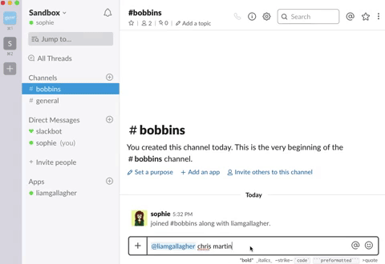

# Gallagherbot

## What is Gallagherbot?

Simply, a slackbot Liam Gallagher.

Mention @liamgallagher and a subject and if he can chime in with a remark or two, you know he will.

## How did I build Gallagherbot?

Using Slack's API and Python client library. 

## Why did I build Gallagherbot?

Liam Gallagher in my opinion is a comedy genius. Who wouldn't want a Liam bot that chat's nonsense.

I began learning Python and wanted something practical I could apply my learning to. The project was supposed to be a short and fun introduction to Python for me. I'm familiar with Slack and their API docs are pretty good for a newbie. I found a great guide on fullstackpython.com that I lent on for structure.

## Lessons learnt:

- how to read API documentation
- a furthering of my python knowledge
- bug fixing/reading a stacktrace
- googling answers/asking communities
- oAuth and exporting keys and secrets
- setting up and using a virtualenv

## The future of Gallagherbot:

At the moment the bot is only local to my sandbox Slack environment, but I'd like to at the very least make this available for other Slack workspaces.

Other ideas:
- have Gallagherbot able to jump in at a keyword, rather than only at a @mention.
- have a Noelbot, that can converse with Liam. Noel is just as comical as Liam.

